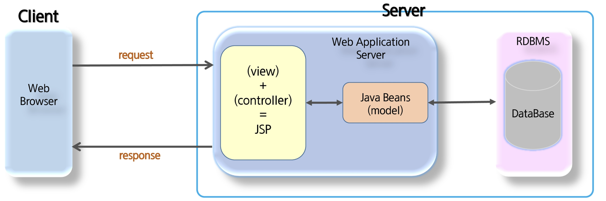
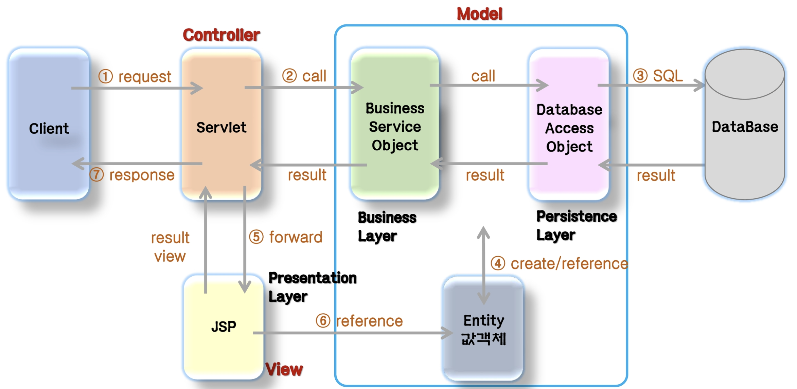

## Intro

Today, I learnd MVC Architecture in SSAFY. I write down this post to improve my understanding and organization what i learnd. Before developing the web applications, we need to have idea about design models. It that organized with java server page is seperated into model 1 and model 2.

## Keywords

- Model View Controller (MVC)
- Model 1 & Model 2
- JSP, Servlet

## Model 1

_Model 1 Architecture_

Servlet and JSP are the main technologies to develop the web applications. Servlet was considered superior to CGI. Servlet technology doesn't create process, rather it creates thread to handle request. The advantage of creating thread over process is that it doesn't allocate separate memory area. Thus many subsequent requests can be easily handled by servlet. Problem in Servlet technology Servlet needs to recompile if any designing code is modified. It doesn't provide separation of concern. Presentation and Business logic are mixed up. JSP overcomes almost all the problems of Servlet. It provides better separation of concern, now presentation and business logic can be easily separated. You don't need to redeploy the application if JSP page is modified. JSP provides support to develop web application using JavaBean, custom tags and JSTL so that we can put the business logic separate from our JSP that will be easier to test and debug.

### Advantage and Disadvantage of Model 1

- Advantage
  - Easy and Quick to develop web application
- Disadvantage
  - Navigation control is decentralized since every page contains the logic to determine the next page. If JSP page name is changed that is referred by other pages, we need to change it in all the pages that leads to the maintenance problem.
  - Time consuming You need to spend more time to develop custom tags in JSP. So that we don't need to use scriptlet tag.
  - Hard to extend It is better for small applications but not for large applications.

## Model 2

_Model 2 Architecture_

Model 2 is based on the MVC (Model View Controller) design pattern. The MVC design pattern consists of three modules model, view and controller.

- Model : The model represents the state (data) and business logic of the application.
- View : The view module is responsible to display data i.e. it represents the presentation.
- Controller : The controller module acts as an interface between view and model. It intercepts all the requests i.e. receives input and commands to Model / View to change accordingly.

### Advantage and Disadvantage of Model 2

- Advantage
  - Navigation control is centralized Now only controller contains the logic to determine the next page.
  - Easy to maintain
  - Easy to extend
  - Easy to test
  - Better separation of concerns
- Disadvantage
  - We need to write the controller code self. If we change the controller code, we need to recompile the class and redeploy the application.
  - More expensice than model 1.

## Reference

- https://www.tutorialspoint.com/design_pattern/mvc_pattern.htm
- https://www.edureka.co/blog/mvc-architecture-in-java/
- https://m.blog.naver.com/PostView.naver?isHttpsRedirect=true&blogId=ka28&logNo=222007545854
